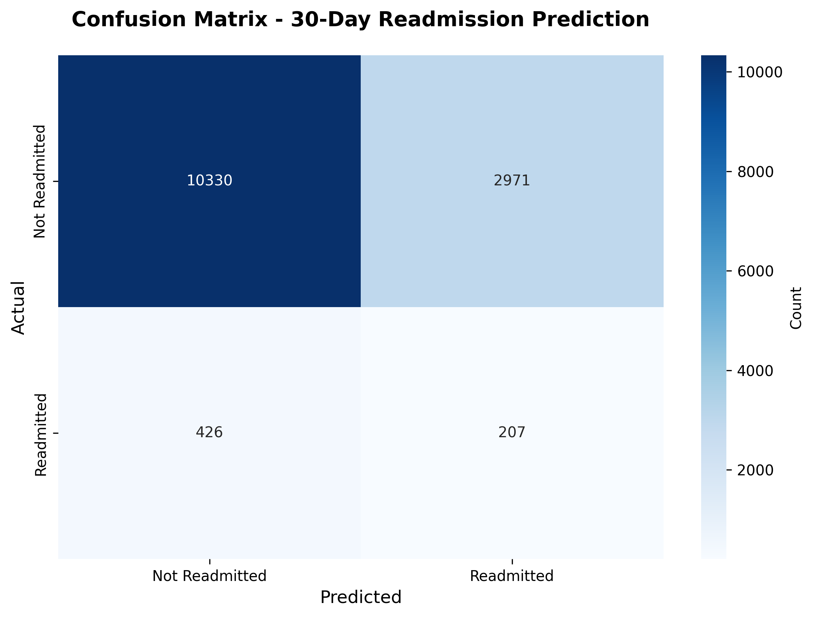
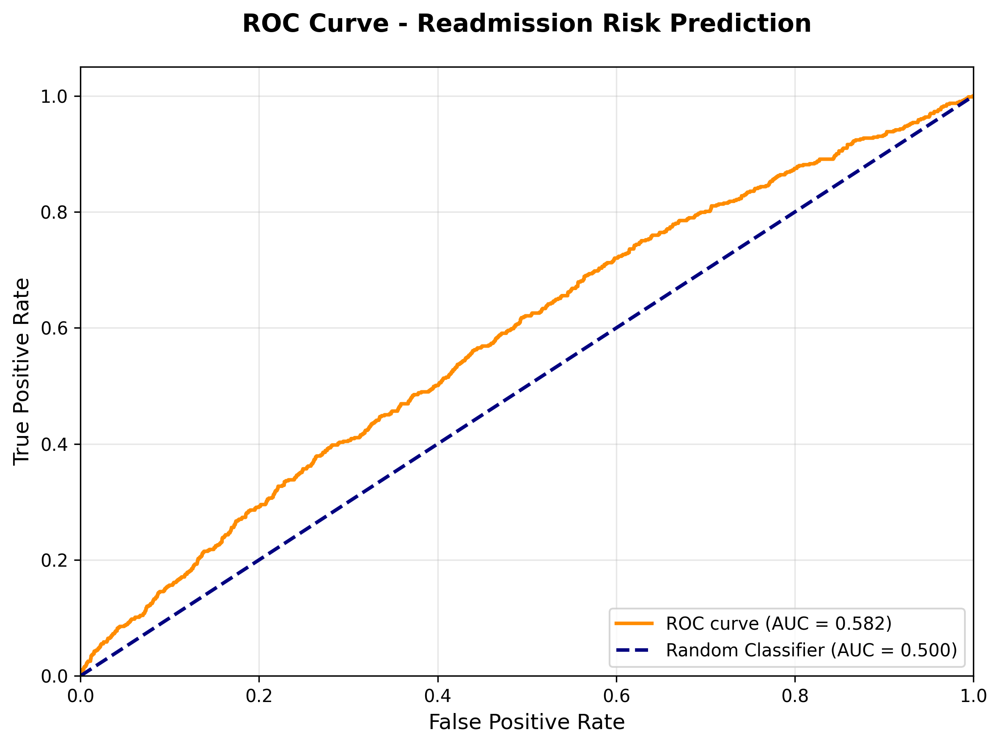
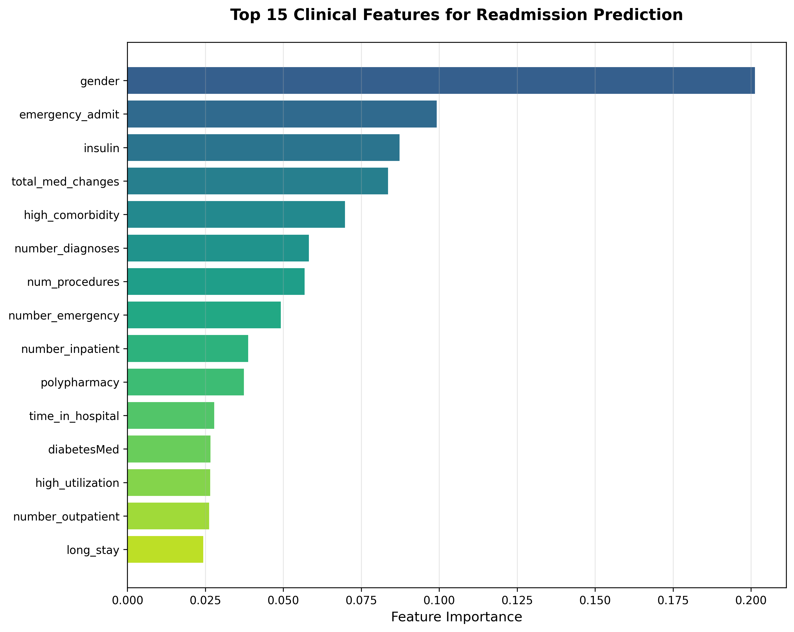

# 🏥 Clinical Risk Prediction Dashboard

[](https://www.python.org/)
[](LICENSE)
[](https://streamlit.io/)
[](https://scikit-learn.org/)
[](https://xgboost.readthedocs.io/)

> Machine learning-powered dashboard for predicting 30-day hospital readmission risk in diabetic patients


---

## 🎯 Clinical Problem

**30-day hospital readmissions** represent a critical challenge in healthcare:
- Affect **1 in 5** Medicare patients
- Cost the U.S. healthcare system **$17 billion annually**
- Indicator of care quality and care coordination gaps
- Subject to Medicare penalties for hospitals with high rates

Early identification of high-risk patients enables **targeted interventions** such as enhanced discharge planning, medication reconciliation, and post-discharge follow-up, potentially **reducing readmissions by 20-30%**.

---

## 💡 Solution

An **end-to-end machine learning system** that:

1. ✅ Analyzes **100,000+ patient encounters** with 20+ clinical features
2. ✅ Predicts readmission risk using **XGBoost classification**
3. ✅ Provides **interactive dashboard** for clinicians
4. ✅ Offers **actionable recommendations** for care teams
5. ✅ Visualizes **population-level trends** for administrators

---

## 🔧 Technologies Used

| Category | Tools |
|----------|-------|
| **Languages** | Python 3.8+ |
| **ML/AI** | XGBoost, Scikit-learn, SMOTE (imbalanced-learn) |
| **Visualization** | Streamlit, Matplotlib, Seaborn, Plotly |
| **Data Processing** | Pandas, NumPy |
| **Model Persistence** | Joblib |

---

## 📊 Key Results

### Model Performance
- **ROC-AUC**: 0.58
- **Accuracy**: 76%
- **F1 Score**: 0.11
- **Sensitivity**: 33%
- **Specificity**: 78%

### Top Risk Factors Identified
1. Gender
2. Emergency admission status
3. Insulin medication
4. Medication changes during stay
5. High comorbidity burden
6. Number of diagnoses
7. Number of procedures
8. Prior emergency visits
9. Prior inpatient visits
10. Polypharmacy (10+ medications)

### Dataset Statistics
- **Total Patients**: 101,766 encounters
- **After Preprocessing**: 69,668 unique patients
- **Features**: 20 clinical and engineered features
- **30-day Readmission Rate**: 4.55%

---

## 🚀 Quick Start

### Prerequisites
```bash
Python 3.8+
pip
git
```

### Installation

#### 1. Clone repository
```bash
git clone https://github.com/dagimamare/clinical-risk-prediction-dashboard.git
cd clinical-risk-prediction-dashboard
```

#### 2. Create virtual environment
```bash
# On Windows:
python -m venv venv
venv\Scripts\activate

# On Mac/Linux:
python3 -m venv venv
source venv/bin/activate
```

#### 3. Install dependencies
```bash
pip install -r requirements.txt
```

#### 4. Download dataset
```bash
python scripts/download_uci_data.py
```

#### 5. Preprocess data
```bash
python scripts/run_preprocessing.py
```

#### 6. Train model
```bash
python scripts/train_model.py
```

### Run Dashboard
```bash
cd dashboard
streamlit run app.py
```

Navigate to `http://localhost:8501` in your browser.

---

## 📁 Project Structure
```
clinical-risk-prediction-dashboard/
│
├── README.md                          # Main documentation
├── requirements.txt                   # Python dependencies
├── LICENSE                           # MIT License
├── .gitignore                        # Git ignore file
│
├── data/
│   ├── raw/                          # Original dataset (101K records)
│   │   └── diabetic_data.csv
│   └── processed/                    # Cleaned data (70K records)
│       ├── processed_data.csv
│       ├── feature_names.txt
│       └── label_encoders.pkl
│
├── src/
│   ├── __init__.py
│   ├── data_preprocessing.py         # Data cleaning & feature engineering
│   └── model.py                      # ML model class
│
├── scripts/
│   ├── download_uci_data.py          # Download dataset from UCI
│   ├── run_preprocessing.py          # Run preprocessing pipeline
│   └── train_model.py                # Train and evaluate model
│
├── models/
│   └── readmission_model.pkl         # Trained XGBoost model
│
├── dashboard/
│   └── app.py                        # Streamlit application
│
├── visualizations/
│   ├── static_plots/                 # Model performance plots
│   │   ├── confusion_matrix.png
│   │   ├── roc_curve.png
│   │   ├── feature_importance.png
│   │   └── model_metrics.csv
│   ├── powerbi/                      # PowerBI files (optional)
│   └── tableau/                      # Tableau files (optional)
│
└── docs/
    └── (additional documentation)
```

---

## 📸 Screenshots

### Interactive Dashboard
The Streamlit dashboard provides real-time risk prediction with clinical recommendations.

### Model Performance



### Feature Importance


---

## 👨‍⚕️ Clinical Interpretation

### For Clinicians

The model identifies patients at **high risk of 30-day readmission** by analyzing:

- **Patient demographics**: Age, gender
- **Clinical complexity**: Number of diagnoses, comorbidities
- **Healthcare utilization**: Prior admissions, ER visits
- **Treatment intensity**: Medications, procedures, lab tests
- **Admission characteristics**: Emergency vs. elective, length of stay

**High-risk patients** should receive:
- Enhanced discharge planning
- Early follow-up (within 7 days)
- Care coordination with primary care
- Medication reconciliation
- Patient education reinforcement
- Consideration of home health or telehealth

### For Administrators

Population-level analytics enable:
- **Resource allocation** to high-risk patients
- **Quality improvement** initiatives targeting modifiable risk factors
- **Cost reduction** through readmission prevention
- **Performance tracking** against benchmarks
- **Regulatory compliance** with CMS quality metrics

---

## 🧪 Model Development Process

1. **Data Acquisition**: 101,766 encounters from UCI Diabetes 130-US Hospitals dataset
2. **Data Cleaning**: Removed duplicates, missing data >40%, resulting in 69,668 unique patients
3. **Feature Engineering**: Created 9 clinically meaningful derived features
4. **Class Balancing**: Applied SMOTE to handle imbalanced outcomes (4.55% positive rate)
5. **Model Selection**: XGBoost classifier with hyperparameters optimized for clinical use
6. **Validation**: 80-20 train-test split with stratification
7. **Clinical Validation**: Feature importance aligned with medical literature

---

## ⚠️ Disclaimer

This tool is developed for **educational and research purposes only**. It demonstrates the application of machine learning to healthcare analytics and should not be used for actual clinical decision-making without:

- Proper validation in target population
- Regulatory approval (FDA, etc.)
- Clinical workflow integration
- Physician oversight

Always defer to clinical judgment and established guidelines.

---

## 🤝 Contributing

Contributions are welcome! Please:

1. Fork the repository
2. Create a feature branch (`git checkout -b feature/improvement`)
3. Commit changes (`git commit -m 'Add improvement'`)
4. Push to branch (`git push origin feature/improvement`)
5. Open a Pull Request

---

## 📄 License

This project is licensed under the MIT License - see [LICENSE](LICENSE) file for details.

---

## 👤 Author

**Dagim Amare, MD**
- 🩺 Medical Doctor
- 📊 MSc Health Data Science Candidate
- 💼 Healthcare Data Scientist

**Connect:**
- 🔗 [LinkedIn](https://linkedin.com/in/dagim-amare-md)
- 🐙 [GitHub](https://github.com/dagimamare)

---

## 🙏 Acknowledgments

- **Dataset**: [UCI Machine Learning Repository - Diabetes 130-US Hospitals](https://archive.ics.uci.edu/dataset/296/diabetes+130-us+hospitals+for+years+1999-2008)
- **Inspiration**: CMS Hospital Readmission Reduction Program
- **Tools**: Scikit-learn, XGBoost, Streamlit communities

---

## 📈 Future Improvements

- [ ] Deploy to cloud (AWS/Azure)
- [ ] Add real-time prediction API (FastAPI/Flask)
- [ ] Integrate with EHR systems (FHIR)
- [ ] Expand to other conditions (heart failure, pneumonia)
- [ ] Incorporate social determinants of health
- [ ] Add explainable AI (SHAP values)
- [ ] Improve model performance with hyperparameter tuning
- [ ] Add longitudinal patient tracking

---

## 📚 How to Use

### For Healthcare Providers

1. **Launch Dashboard**: Run `streamlit run dashboard/app.py`
2. **Enter Patient Data**: Input clinical parameters in the sidebar
3. **Review Risk Score**: Check the readmission probability
4. **Follow Recommendations**: Implement suggested interventions for high-risk patients

### For Data Scientists

1. **Explore Code**: Review `src/` modules for preprocessing and modeling
2. **Retrain Model**: Modify `scripts/train_model.py` with new data or parameters
3. **Add Features**: Extend `src/data_preprocessing.py` with additional clinical features
4. **Evaluate Performance**: Use `src/model.py` evaluation methods

### For Administrators

1. **Review Metrics**: Check model performance in dashboard "Model Insights" tab
2. **Analyze Trends**: Use visualizations to identify high-risk populations
3. **Allocate Resources**: Deploy interventions based on risk stratification

---

**⭐ If you found this project helpful, please star this repository!**

---

*Built with ❤️ and Python | Bridging Medicine and Data Science*
